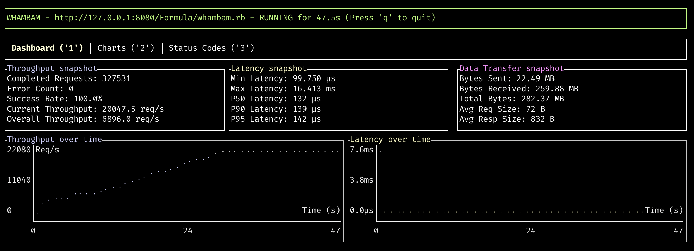

# Whambam 🚀

An open-source, unobtrusive, lightning-fast CLI tool for HTTP(S) endpoint performance testing with a handy interactive terminal UI.

[](https://opensource.org/licenses/MIT)

[](https://github.com/cloudy-native/whambam.dev/actions/workflows/ci.yml)
[](https://github.com/cloudy-native/whambam.dev/actions/workflows/release.yml)

**Visit [whambam.dev](https://whambam.dev) for comprehensive documentation and examples.**



## Why Whambam?

```
$ brew info hey
==> hey: stable 0.1.4 (bottled)
HTTP load generator, ApacheBench (ab) replacement
https://github.com/rakyll/hey
Deprecated because it is not maintained upstream! It will be disabled on 2026-01-12.
```

The beloved HTTP testing tool [hey](https://github.com/rakyll/hey) is no longer maintained, leaving a gap in the developer toolkit. Whambam fills that void:

- Has **Drop-in compatibility** with hey's command-line arguments
- Adds **Modern interactive UI** with real-time metrics and charts
- Is **Actively maintained** and receives continuous improvements
- Is a **clean-room implementation** in Rust for reliability and performance

Built with the same terminal-focused philosophy that made hey popular, and designed for the modern development workflow.

## ✨ Key Features

### Performance Testing
- **Blazing fast** HTTP(S) endpoint testing
- **Configurable concurrency** and request counts
- **Rate limiting** for controlled load testing
- **Multiple HTTP methods** (GET, POST, PUT, DELETE, PATCH, HEAD, OPTIONS, TRACE, CONNECT)
- **Custom headers and authentication** support

### Interactive Dashboard
- **Real-time metrics** with live updates
- **Combined throughput + latency chart** on the dashboard (shared time axis, dual scales)
- **Full charts tab** for separate throughput and latency views
- **Status code breakdown** with color-coded responses
- **Multiple view modes** (Dashboard, Charts, Status Codes)

### Developer Experience
- **hey-compatible** command-line flags where it matters
- **Interactive terminal UI** (default)
- **Comprehensive error handling** and timeout controls
- **Proxy support** for complex network setups

## 📦 Installation

### Homebrew (Recommended)
```bash
# Add tap and install
brew tap cloudy-native/whambam
brew install whambam

# Or install directly
brew install cloudy-native/whambam/whambam
```

### From Source
```bash
git clone https://github.com/cloudy-native/whambam.dev.git
cd whambam.dev
cargo build --release
# binary at target/release/whambam
```

## 🚀 Quick Start

```bash
# Basic performance test
whambam https://example.com

# Custom configuration
whambam https://example.com -n 1000 -c 20

# POST request with JSON payload
whambam https://api.example.com/users \
  -m POST \
  -d '{"name":"Test User"}' \
  -H "Content-Type: application/json"

# Time-limited test with rate limiting
whambam https://example.com -z 30s -q 100 -c 10
```

## 📖 Usage Reference

```bash
whambam <URL> [OPTIONS]
```

### Core Options
| Option | Description | Default |
|--------|-------------|---------|
| `-n, --requests <N>` | Number of requests to send | 200 |
| `-c, --concurrent <N>` | Concurrent connections | 50 |
| `-z, --duration <TIME>` | Test duration (e.g., 30s, 5m, 1h) | unlimited |
| `-t, --timeout <SEC>` | Request timeout in seconds | 20 |
| `-q, --rate-limit <QPS>` | Rate limit (queries per second) | unlimited |

### HTTP Configuration
| Option | Description | Default |
|--------|-------------|---------|
| `-m, --method <METHOD>` | HTTP method (GET, POST, PUT, DELETE, PATCH, HEAD, OPTIONS, …) | GET |
| `-d, --body <BODY>` | Request body | - |
| `-D, --body-file <FILE>` | Request body from file | - |
| `-H, --header <HEADER>` | Custom headers (repeatable) | - |
| `-A, --accept <HEADER>` | Accept header | - |
| `-T, --content-type <TYPE>` | Content-Type header | text/html |
| `-a, --auth <USER:PASS>` | Basic authentication | - |

### Network Options
| Option | Description |
|--------|-------------|
| `-x, --proxy <HOST:PORT>` | HTTP proxy |
| `--disable-compression` | Disable compression |
| `--disable-keepalive` | Disable connection reuse |
| `--disable-redirects` | Disable redirect following |

### Output Options
| Option | Description |
|--------|-------------|
| `--no-ui` | Reserved; interactive UI is required in the current release |

## 🎯 Interactive UI Guide

### Navigation
- **`1`, `2`, `3`**: Switch between Dashboard, Charts, and Status Codes tabs
- **`h` or `?`**: Toggle help overlay
- **`r`**: Restart the test (after completion)
- **`Ctrl-C`, `q`, or `ESC`**: Exit application

### Dashboard Tab
Real-time performance metrics including:
- **Throughput**: Current and overall requests per second
- **Success Rate**: Percentage of successful requests
- **Response Times**: Min, max, and percentile latency (p50–p99)
- **Combined chart**: Throughput (req/s, left) and latency (ms, right) on one shared timeline

### Charts Tab
Full-screen visualization of:
- **Throughput over time**
- **Latency over time**

### Status Codes Tab
Detailed breakdown of HTTP responses:
- **Color-coded by status class** (2xx, 3xx, 4xx, 5xx)
- **Percentage distribution**
- **Real-time updates**

## 🧪 Local Testing Setup

Quickly test your installation with a local HTTP server. Python’s built-in server works on macOS, Linux, and Windows without extra packages:

```bash
# Terminal 1 — serve the current directory on port 8080
python3 -m http.server 8080

# Terminal 2 — load-test it
whambam http://localhost:8080 -n 100 -c 10

# Or run for a fixed duration
whambam http://localhost:8080 -z 10s -c 50
```

`python3` ships with macOS (and most Linux distros). No Node/`http-server` install required.

## 🏗️ Architecture

```
src/
├── main.rs                 # CLI parsing and application entry point
├── lib.rs                  # Library entry (shared args / run)
├── tester/
│   ├── unified_runner.rs   # Async worker pool + HTTP client
│   ├── metrics.rs          # Lock-free metrics collection
│   └── types.rs            # Config, request metrics, shared UI state
├── ui/
│   ├── app.rs              # Terminal UI application logic
│   └── widgets.rs          # Dashboard, charts, status widgets
└── tests/                  # Unit and integration tests
```

## 🤖 AI-Powered Development

This project was built in collaboration with [Claude Code](https://www.anthropic.com/claude-code), demonstrating effective AI-assisted development practices:

### Key Learnings
1. **Always start with a plan** - Get AI to outline the approach before letting it write a line of code
2. **Make incremental changes** - Small, testable steps prevent large rollbacks
3. **Write tests eagerly** - Add comprehensive tests before major refactoring
4. **Leverage AI for systemic changes** - AI excels at large-scale code transformations
5. **Iterate and improve** - Don't hesitate to ask AI to fix its own mistakes

### Development Stats
- **Total AWS Bedrock cost**: $34.92
- **AWS Bedrock model used**: `us.anthropic.claude-3-7-sonnet-20250219-v1:0`
- **Code split**: ~30% human-written structure, ~70% AI-generated implementation
- **Test coverage**: Comprehensive suite with AI-generated tests

## 🤝 Contributing

We welcome contributions! Here's how to get started:

1. **Fork the repository**
2. **Create a feature branch** (`git checkout -b feature/amazing-feature`)
3. **Make your changes** with tests
4. **Run the test suite** (`cargo test`)
5. **Submit a pull request**

Please read our [Contributing Guidelines](CONTRIBUTING.md) for detailed information.

## 📄 License

This project is licensed under the MIT License - see the [LICENSE](LICENSE) file for details.

## 🙏 Acknowledgments

- Inspired by the excellent [hey](https://github.com/rakyll/hey) tool
- Built with [Claude Code](https://www.anthropic.com/claude-code) AI assistance
- Thanks to the Rust community for excellent libraries, tools, and ecosystem 
